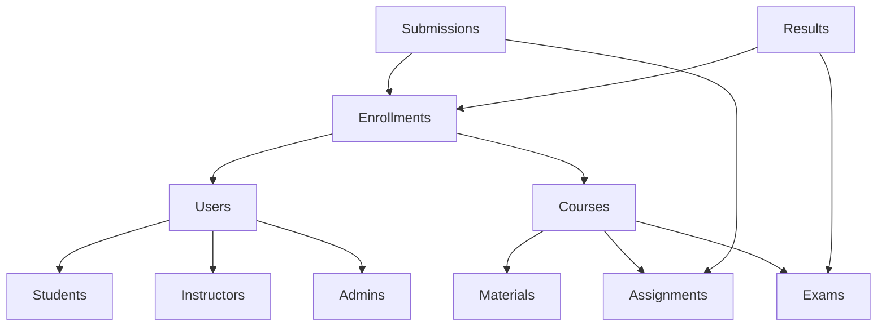

# Shiksha Samarth

[](https://opensource.org/licenses/ISC)
[](https://nodejs.org/)
[](https://reactjs.org/)
[](https://www.mongodb.com/)

A comprehensive eLearning platform built with the MERN stack to facilitate online education and course management.

## Table of Contents

- [Features](#features)
- [Architecture](#architecture)
- [Technology Stack](#technology-stack)
- [Quick Start](#quick-start)
- [Installation](#installation)
- [Environment Setup](#environment-setup)
- [User Roles & Permissions](#user-roles--permissions)
- [Database Schema](#database-schema)
- [Testing](#testing)
- [Deployment](#deployment)
- [Contributing](#contributing)
- [License](#license)
- [Contact](#contact)

## Features

### For Students
- **Course Enrollment**: Browse and enroll in available courses
- **Assignment Submission**: Upload assignments as PDF files
- **Exam Participation**: Take multiple-choice exams with auto-grading
- **Deadline Tracking**: View upcoming assignment and exam deadlines
- **Progress Monitoring**: Track performance and marks across all courses
- **Profile Management**: Update personal information and preferences

### For Instructors
- **Course Management**: Create, edit, and manage course content
- **Assignment Creation**: Design and assign coursework to students
- **Auto-Graded Exams**: Create MCQ exams with automatic scoring
- **Announcements**: Post updates and notifications for students
- **Student Progress**: Monitor individual and class performance
- **Analytics Dashboard**: View detailed course and student analytics

### For Admins
- **Course Administration**: Full CRUD operations on courses
- **User Management**: Manage students, instructors, and admin accounts
- **Instructor Assignment**: Assign instructors to specific courses
- **System Analytics**: Comprehensive view of all platform activities
- **System Configuration**: Manage platform settings and defaults

## Architecture

```
┌─────────────────┐    ┌───────────────────┐    ┌─────────────────┐
│   Frontend      │    │   Backend         │    │   Database      │
│   (React)       │◄──►│   (Node.js)       │◄──►│   (MongoDB)     │
│                 │    │                   │    │                 │
│ • Components    │    │ • REST APIs       │    │ • Users         │
│ • Pages         │    │ • Authentication  │    │ • Courses       │
│ • State Mgmt    │    │ • File Upload     │    │ • Assignments   │
│ • Routing       │    │ • Email Service   │    │ • Exams         │
└─────────────────┘    └───────────────────┘    └─────────────────┘
```

## Technology Stack

### Frontend
- **React 18** - Modern JavaScript library for building user interfaces
- **Vite** - Fast build tool and development server
- **Material-UI (MUI)** - React components implementing Google's Material Design
- **Bootstrap 5** - Responsive CSS framework
- **React Router** - Declarative routing for React
- **PDF Viewer** - Document viewing capabilities
- **Axios** - HTTP client for API requests

### Backend
- **Node.js** - JavaScript runtime environment
- **Express.js** - Web application framework
- **JWT** - JSON Web Token for authentication
- **bcrypt** - Password hashing
- **Nodemailer** - Email service integration
- **Multer** - File upload middleware
- **CORS** - Cross-Origin Resource Sharing
- **Rate Limiting** - API rate limiting

### Database & DevOps
- **MongoDB** - NoSQL database
- **Mongoose** - MongoDB object modeling
- **UUID** - Unique identifier generation
- **Mocha** - Testing framework
- **NPM** - Package management

## Quick Start

Get the application running locally in just a few steps:

```bash
# Clone the repository
git clone https://github.com/shreekunal/ElearningPortal-main.git
cd ElearningPortal-main

# Install all dependencies
npm run install-all

# Start development servers
npm run dev
```

Visit `http://localhost:5173` to access the application!

## Installation

### Prerequisites
- **Node.js** (v16 or higher)
- **MongoDB** (local or cloud instance)
- **Git**

### Step-by-Step Installation

1. **Clone the Repository**
   ```bash
   git clone https://github.com/shreekunal/ElearningPortal-main.git
   cd ElearningPortal-main
   ```

2. **Install Dependencies**
   ```bash
   # Install root dependencies
   npm install

   # Install backend dependencies
   cd BackEnd && npm install && cd ..

   # Install frontend dependencies
   cd FrontEnd && npm install && cd ..
   ```

3. **Environment Configuration**
   ```bash
   # Copy environment template
   cp env.example.js env.js

   # Edit env.js with your configuration
   nano env.js
   ```

4. **Database Setup**
   - Ensure MongoDB is running locally or update connection string in `env.js`
   - The application will automatically create collections on first run

5. **Create Admin User**
   ```bash
   cd BackEnd
   node create-admin.js
   ```

## Environment Setup

Create an `env.js` file in the root directory with the following configuration:

```javascript
const Front_Port = 5173;
const Back_Port = 3008;
const Front_Origin = `http://localhost:${Front_Port}`;
const Back_Origin = `http://localhost:${Back_Port}`;

// Security Keys
const Secret_Key = 'your-jwt-secret-key-here';
const Database_URI = "your-mongodb-connection-string";

// Default Admin Credentials
const DEFAULT_ADMIN_NAME = 'Admin User';
const DEFAULT_ADMIN_EMAIL = 'admin@elearning.com';
const DEFAULT_ADMIN_USERNAME = 'admin';
const DEFAULT_ADMIN_PASSWORD = 'Admin@123';
const DEFAULT_ADMIN_ROLE = 'Admin';

module.exports = {
    Front_Port,
    Back_Port,
    Front_Origin,
    Back_Origin,
    Database_URI,
    Secret_Key,
    DEFAULT_ADMIN_NAME,
    DEFAULT_ADMIN_EMAIL,
    DEFAULT_ADMIN_USERNAME,
    DEFAULT_ADMIN_PASSWORD,
    DEFAULT_ADMIN_ROLE
};
```

## User Roles & Permissions

### Student Dashboard
| Feature | Description | Access Level |
|---------|-------------|--------------|
| Course Enrollment | Browse and join courses | Full |
| Assignment Submission | Upload PDF assignments | Full |
| Exam Participation | Take MCQ exams | Full |
| Progress Tracking | View grades and analytics | Full |
| Profile Management | Update personal info | Full |

### Instructor Dashboard
| Feature | Description | Access Level |
|---------|-------------|--------------|
| Course Creation | Design and publish courses | Full |
| Content Management | Add materials and resources | Full |
| Assignment Design | Create and grade assignments | Full |
| Exam Creation | Build auto-graded MCQ exams | Full |
| Student Analytics | Monitor class performance | Read-Only |

### Admin Dashboard
| Feature | Description | Access Level |
|---------|-------------|--------------|
| User Management | CRUD operations on all users | Full |
| Course Oversight | Manage all courses | Full |
| System Analytics | Platform-wide statistics | Read-Only |
| Role Assignment | Assign instructors to courses | Full |
| System Settings | Configure platform defaults | Full |

## Database Schema

### Collections Overview



### Detailed Schema

#### Users Collection
```javascript
{
  _id: ObjectId,
  name: String,
  email: String,
  username: String,
  password: String, // Hashed
  role: String, // 'Student' | 'Instructor' | 'Admin'
  gender: String,
  id: String, // UUID
  createdAt: Date,
  updatedAt: Date
}
```

#### Courses Collection
```javascript
{
  _id: ObjectId,
  title: String,
  description: String,
  instructor: ObjectId, // Reference to Users
  materials: [ObjectId], // References to Materials
  assignments: [ObjectId], // References to Assignments
  exams: [ObjectId], // References to Exams
  enrolledStudents: [ObjectId], // References to Users
  createdAt: Date,
  updatedAt: Date
}
```

## Testing

### Backend Testing
```bash
cd BackEnd
npm test
```

### Frontend Testing
```bash
cd FrontEnd
npm run test
```

### Manual Testing Checklist
- [ ] User registration and login
- [ ] Course creation and enrollment
- [ ] Assignment submission and grading
- [ ] Exam creation and auto-grading
- [ ] Admin user management
- [ ] File upload functionality
- [ ] Email notifications

## Deployment

### Environment Variables for Production
```bash
NODE_ENV=production
MONGODB_URI=your_production_mongodb_uri
JWT_SECRET=your_secure_jwt_secret
EMAIL_SERVICE=gmail
EMAIL_USER=your_email@gmail.com
EMAIL_PASS=your_app_password
```

### Build Commands
```bash
# Build frontend
npm run build-client

# Start production server
npm run start-server
```

### Recommended Hosting
- **Frontend**: Vercel, Netlify, or AWS S3 + CloudFront
- **Backend**: Heroku, DigitalOcean, or AWS EC2
- **Database**: MongoDB Atlas or AWS DocumentDB

## Contributing

We welcome contributions! Please follow these steps:

1. **Fork** the repository
2. **Create** a feature branch: `git checkout -b feature/amazing-feature`
3. **Commit** your changes: `git commit -m 'Add amazing feature'`
4. **Push** to the branch: `git push origin feature/amazing-feature`
5. **Open** a Pull Request

### Development Guidelines
- Follow ESLint configuration
- Write meaningful commit messages
- Add tests for new features
- Update documentation as needed
- Ensure all tests pass before submitting PR

## License

This project is licensed under the ISC License - see the [LICENSE](LICENSE) file for details.

## Contact

**Kunal Singh** - Project Lead & Full-Stack Developer

- **Email**: [shrii.kunal@gmail.com](mailto:shrii.kunal@gmail.com)
- **GitHub**: [@shreekunal](https://github.com/shreekunal)
- **LinkedIn**: [Your LinkedIn Profile]

---

<div align="center">

**Made with ❤️ by Kunal Singh**

⭐ Star this repo if you find it helpful!

[⬆️ Back to Top](#shiksha-samarth)

</div>
